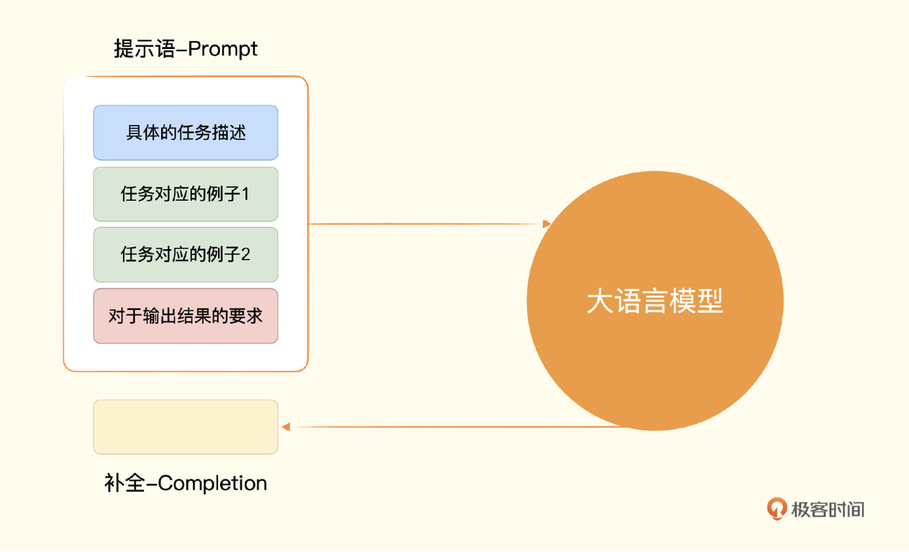

<b>先看一个智能客服的例子：</b>

```
import openai
import os

openai.api_key = os.environ.get("OPENAI_API_KEY")
COMPLETION_MODEL = "text-davinci-003"
prompt = '请你用朋友的语气回复给到客户，并称他为“亲”，他的订单已经发货在路上了，预计在3天之内会送达，订单号2
def get_response(prompt, temperature = 1.0):
    completions = openai.Completion.create (
        engine=COMPLETION_MODEL,
        prompt=prompt,
        max_tokens=1024,
        n=1,
        stop=None,
        temperature=temperature,
    )
    message = completions.choices[0].text
    return message
```

`print(get_response(prompt))`

> 亲，您的订单已经顺利发货啦！订单号是 2021AEDG，预计在 3 天之内会寄到您指定的地址。不好意思，给您带来了不便，原计划到货时间受天气原因影响而有所延迟。期待您收到衣服后给我们反馈意见哦！谢谢你选购我们的商品！

`print(get_response(prompt))`

> 亲，您的订单 2021AEDG 刚刚已经发出，预计 3 天之内就会送达您的手中。抱歉由于天气的原因造成了物流延迟，但我们会尽快将订单发到您的手中。感谢您对我们的支持！

以上代码中，通过给 Completion 接口发送了一段小小的提示语（Prompt）。AI 的确理解了我们的意图，并给出了一段正确合理的回复。
而每次回复的内容不一样，则归功于我们使用的一个参数 temperature。这个参数的输入范围是 0-2 之间的浮点数，代表输出结果的随机性或是说多样性。这个参数怎么设置取决于应用的场景。

Completion 接口的其他参数：
第一个参数是 engine，也就是我们使用的是 Open AI 的那一个引擎。
第二个参数是 prompt，自然就是我们输入的提示语。
第三个参数是 max_tokens，，也就是调用生成的内容允许的最大 token 数量。你可以简单地把 token 理解成一个单词。实际上，token 是分词之后的一个字符序列里的一个单元。
第四个参数 n，代表你希望 AI 给你生成几条内容供你选择。
第五个参数 stop，代表你希望模型输出的内容在遇到什么内容的时候就停下来。这个参数我们常常会选用 "\n\n"这样的连续换行，因为这通常意味着文章已经要另起一个新的段落了，既会消耗大量的 token 数量，又可能没有必要。我们在下面试了一下，将“，”作为 stop 的参数，你会发现模型在输出了“亲”之后就停了下来。
`print(get_response(prompt, 0.0, "，"))`

> 亲

#### AI 聊天机器人

多轮回话关联起来，让 GPT 能够记住上下文。我们只需要在提示词里，在问问题之前加 “Q :” 表示这是一个问题，另起一行，加上“A :” 表示我想要一个回答。那么 Completion 的接口就会回答你在 “Q : ” 里面跟的问题。

```
question = """
Q : 鱼香肉丝怎么做？
A :
"""
print(get_response(question))
```

#### 让 AI 帮我解决情感分析问题

仍然简单地调用 Completion 的 API 一次，只是需要再把提示语分成三个组成部分。

1. 第一部分是我们给到 AI 的指令，也就是告诉它要去判断用户评论的情感。
2. 第二部分是按照一个固定格式给它两个例子，一行以“评论：”开头，后面跟着具体的评论，另一行以“情感：”开头，后面跟着这个例子的情感。
3. 第三部分是给出我们希望 AI 判定的评论，同样以“评论：”开头跟着我们想要它判定的评论，另一行也以“情感：”开头，不过后面没有内容，而是等着 AI 给出判定。


**注：常见的大模型的上下文学习能力，通过几个例子，就能回答正确的结果**

像上边例子给了”一个任务描述或、给少数几个例子、给需要解决的问题“，这样三个步骤的组合，一般我们称为<b>Few-Shots-Learning(少量样本学习)</b>。
