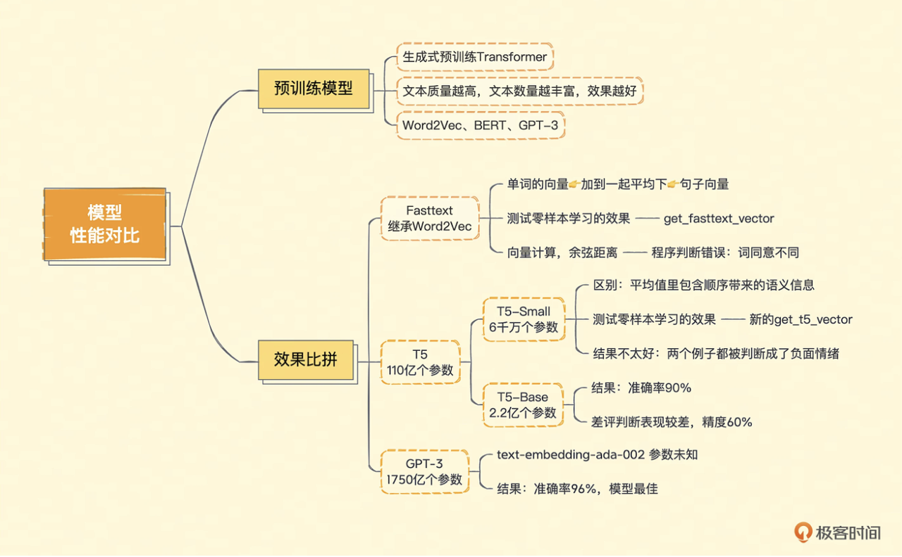

#### 什么是预训练模型？

给出一段文字，OpenAI 就能返回一个 Embedding 向量。依靠于 GPT-3 背后的超大规模的预训练模型（Pre-trained Model）。事实上，GPT 的英文翻译全称就是“生成式预训练 Transformer（Generative Pre-trained Transformer）”

#### Fasttext、T5、GPT-3 模型效果大比拼

第一个是来自 Facebook 的 Fasttext，它继承了 Word2Vec 的思路，能够把一个个单词表示成向量。第二个是来自 Google 的 T5，T5 的全称是 Text-to-Text Transfer Trasnformer，是适合做迁移学习的一个模型。

#### Fasttext 效果测试

利用 Gensim 这个库，把 Facebook 预训练好的模型加载进来。然后，我们定义一个获取文本向量的函数。因为 Fasttext 学到的是单词的向量，而不是句子的向量。我们需要测试一下零样本学习的效果，就不能根据评论数据进一步训练模型了，所以我们把一句话中的每个单词向量，加在一起平均一下，把这个向量作为整段平困的向量。<b>一种将一句话变成向量的办法</b>

可能会出现我们之前说过的单词相同顺序不同的问题。结果不尽如意。例子都判断错了。

#### T5 效果测试

<b>T5-small</b>
T5 模型的全称是 Text-to-Text Transfer Transformer，翻译成中文就是“文本到文本的迁移 Transformer”，也就是说，这个模型就是为了方便预训练之后拿去“迁移”到别的任务上而创造出来的。当时发表的时候，它就在各种数据集的评测上高居榜首。

先加载训练好的 T5 模型的分词器（Tokenizer）,还有对应模型。然后定义一个 get_t5_vector 函数，接受文本输入。然后分词器来分词创建一个序列，然后让模型的编码器部分对其进行编码。编码后的结果，仍然是分词后的一个词一个向量，我们还是把这些向量平均一下，作为整段文本的向量。

这个平均值里，仍然包含了顺序带来的语义信息。每次编码出来结果是不一样的。

结果仍然不好，可能是使用的模型太小了。

<b>T5-base</b>

我们就直接把上面模型的名字从 T5-small 改成 T5-base 就好了，其他代码不需要动，重新运行一遍。

这个结果似乎是我们想到的。

使用 T5 的效果也还可以，考虑所有样本的准确率也能达到 90%。但是在比较困难的判断里，他相比 OpenAI 给到的 Embedding 要差很多，整体的精度只有 60%。我们去看整体模型的准确率的话，OpenAI 的 Embedding 能够到达 96%，还是比这里的 90%要好上一些的。

