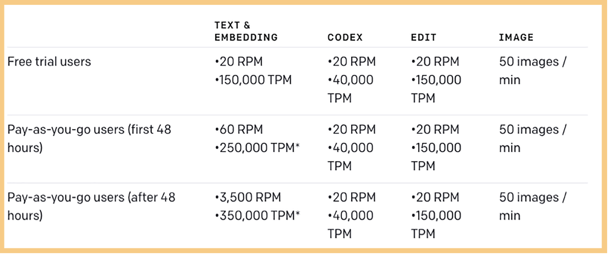
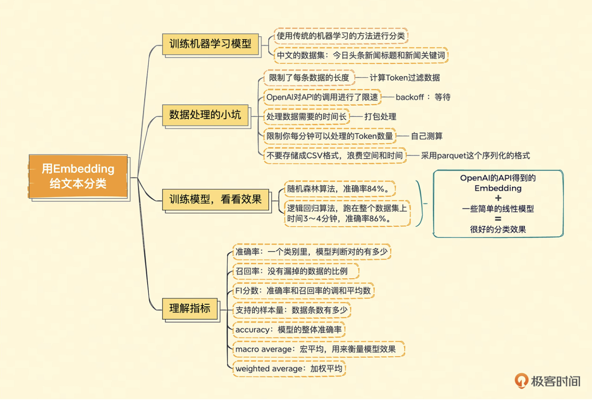

#### Embedding 向量训练分析

OpenAI [官方示例](https://github.com/openai/openai-cookbook/blob/main/examples/Classification_using_embeddings.ipynb)

[测试数据文件](https://github.com/aceimnorstuvwxz/toutiao-text-classfication-dataset)

数据处理过程中的小坑：

1. OpenAI 提供的接口限制了每条数据的长度。 我们使用的是 text-embedding-ada-002 的模型，支持的长度是每条记录 8191 个 Token。所以在发送请求之前，需要计算一下每条记录有多少 Token，超过 8000 个的需要过滤掉。
   上边我们使用了 Tiktoken 这个库，使用了 cl100k_base 这种编码方式，这种编码方式和 text-embedding-ada-002 模型是一致的。使用错的编码方式，自己计算出来的 Token 数量和 OpenAI 的不一样。
2. 如果你直接一条条调用 OpenAI 的 API，很快就会遇到报错。由于 OpenAI 对 API 的调用进行了限速。
   可以使用 backoff 这个 Python 库，在运行过程中如果遇到报错，就等待一段时间。
   一个是限速，一个是延迟，这样更会拖长了处理数据所需要的时间。
   
   OpenAI 是支持 batch 调用接口的，你可以在一个请求里一次批量处理很多个请求。但是一次性打包太多条记录，因为 OpenAI 的限速不仅仅是针对请求数的，也限制你每分钟可以处理的 Token 数量。
3. 对于这样的大数据集，不要存储为 CSV 格式。特别是获取到的 Embedding 数据，是很多浮点数，存储为 CSV 格式会把 4 个字节的浮点数，都用字符串形式存储。浪费空间写入速度也慢。
   可以采用了 parquet 这个序列化的格式，整个存储的过程只需要 1 分钟。

#### 训练模型

通过最常用的 scikit-learn 这个机器学习工具包里面的随机森林（RandomForest）算法，做了一次训练和测试。在我的电脑上，大概 10 分钟可以跑完，整体的准确率可以达到 84%。

使用逻辑回归（LogisticRegression）算法，但我们这次要跑在整个数据集上。一样的，我们拿 80%作为训练，20%作为测试。这一次，虽然数据量是刚才 4 万条数据的好几倍，但是时间上却只要 3 ～ 4 分钟，而最终的准确率也能达到 86%。

#### 理解指标

理解一下上面模型输出的报告是什么意思。报告的每一行都有四个指标，分别是准确率（Precision）、召回率（Recall）、F1 分数，以及支持样本量（Support）。我还是用今日头条的新闻标题这个数据集来解释这些概念。

1. 准确率，代表模型判定属于这个分类的标题里面判断正确的有多少，有多少真的是属于这个分类的。但是并不是准确率达到 100%就代表模型全对了。因为模型可能会漏，所以我们还要老吕召回率。
2. 召回率，代表模型判定属于这个分类的标题占实际这个分类下所有标题的比例，也就是没有漏掉的比例。
3. F1 分数（F1 Score），准确率和召回率的调和平均数，也就是 F1 Score = 2 / (1/Precision + 1/Recall);F1 分数也是越高越好。
4. 支持的样本量，是指数据里面，实际是这个分类的数据条数有多少。一般来说，数据条数越多，这个分类的训练就会越准确。

分类报告里一个类目占一行，每一行都包含对应的这四个指标，而最下面还有三行数据。这三行数据，是整个拿来测试的数据集，所以对应的支持样本量都是 1 万个。

- 第一行的 accuracy，只有一个指标，虽然它在 F1 Score 这个列里，但是并不是 F1 分数的意思。而是说，模型总共判断对的分类/模型测试的样本数，也就是模型的整体准确率。
- 第二行的 macro average，中文名叫做宏平均，宏平均的三个指标，就是把上面每一个分类算出来的指标加在一起平均一下。它主要是在数据分类不太平衡的时候，帮助我们衡量模型效果怎么样。宏平均对于数据样本不太平衡，有些类目样本特别少，有些特别多的场景特别有用。
- 第三行的 weighted average，就是加权平均，也就是我们把每一个指标，按照分类里面支持的样本量加权，算出来的一个值。无论是 Precision、Recall 还是 F1 Score 都要这么按照各个分类加权平均一下。

