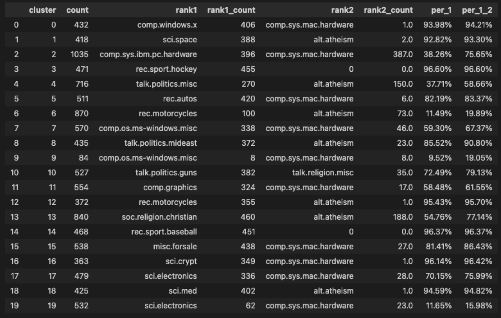

#### 基于 Embedding 向量进行文本聚类

文本聚类就是把很多没有标注过的文本，根据它们之间的相似度，自动地分成几类。

基于 GPT 系列模型进行文本聚类，我们可以通过把文本变成一段变量。对于变量自然可以使用一些简单的聚类方法，比如 K-Means 算法。

这一次我们选用常用的 20 newsgroups 数据集，就是一个带了标记分好类的英文新闻组的数据集。这个数据集其实不是最自然的自然语言，因为做了预处理，比如去掉了标点符号，停用词等。

首先，我们先通过 scikit-learn 这个 Python 库来拿到数据，数据集就内置在这个库里面。直接把数据集下载下来，储存为 CSV 文件。
接着，我们要做预处理，需要过滤掉数据中有些文本为空的情况。以及和我们前面进行文件分类一样，把 token 数量太多的过滤掉。
然后，我们仍然是通过 Embedding 的接口，拿到文本的 Embedding 向量，然后把整个数据存储成 parquet 文件。

> 通常，在使用 Jupyter Notebook 或者 Python 去做机器学习类的任务的时候，我们往往会把一些中间步骤的数据结果给存下来。这样，我们可以避免在后面步骤写了 Bug 或者参数设错的时候从头开始。在这里，我们就把原始数据，以及 Embedding 处理完的数据都存了一份。这样，如果后面的聚类程序要做修改，我们不需要再花钱让 OpenAI 给我们算一次 Embedding 了。

接着，我们就可以用 K-Means 算法来进行聚类了。因为原本的数据来自 20 个不同的新闻组，那么我们也不妨就聚合成 20 个类，正好我们可以做个对比。

通过 NumPy 的 stack 函数，把所有的 Embedding 放到一个矩阵里面，设置一下要聚合出来的类的数量，然后运行一下 K-Means 算法的 fit 函数，就好了。

如何去看它聚类的结果是否合适？每个聚类出来的类代表什么？在这里，我们有设置分组，可以统计一下聚类之后的每个类有多少条各个 newsgroups 分组的数据。然后看看这些数据里面，排名第一的分组是什么。如果我们聚类聚合出来的类，都是从某一个 newsgroup 分组出来的文章，那么说明这个聚合出来的类其实就和那个分组的内容差不多。

1. 我们通过 groupby 可以把之前的 DataFrame 按照 cluster 进行聚合，统计每个 cluster 里面数据的条数。
2. 而要统计某一个 cluster 里面排名第一的分组名称和数量的时候，我们可以通过 groupby，把数据按照 cluster + title 的方式聚合。
3. 再通过 cluster 聚合后，使用 x.nlargest 函数拿到里面数量排名第一的分组的名字和数量。
4. 为了方便分析，我还把数据里排名第一的去掉之后，又统计了一下排名第二的分组，放在一起看一下。

输出结果：


从这个统计数据的结果来看，大部分聚类的结果，能够对应到某一个原本新闻组的分类。

#### 使用提示语对文本进行总结

真实的应用场景，我们拿来的文本聚类的数据，多半没有分组信息。所以人工给聚合出来的类起一个名字，往往需要人工看一下各个类里边的数据是什么。

不过，使用 OpenAI 的 Completion 接口，完全可以让 AI 给我们聚合出来的类起一个名字。

通过 Completion 接口实现思路：

1. 我们随机从聚类结果里的每一个类里面，都挑上 10 条记录，然后分行将这些记录拼在一起。
2. 然后，我们给 AI 这样一段提示语，告诉 AI 这些内容来自新闻组，请 AI 根据它们的共性给这些新闻组的内容取一个 50 个字以内的名字。
3. 输出的内容，我们用 Cluster，Cluster 里原先排名第一的分组英文，以及 AI 给出的新闻组名称，对应的输出结果在下面。

输出结果：

```
Cluster 0, Rank 1: comp.windows.x, Theme: Xlib编程
Cluster 1, Rank 1: sci.space, Theme: 太空技术与航空
Cluster 2, Rank 1: comp.sys.ibm.pc.hardware, Theme: PC硬件与系统
Cluster 3, Rank 1: rec.sport.hockey, Theme: 欧洲冰球vs北美冰球
Cluster 4, Rank 1: talk.politics.misc, Theme: 社会观点与自由
Cluster 5, Rank 1: rec.autos, Theme: 汽车硬件
Cluster 6, Rank 1: rec.motorcycles, Theme: 数学与文化冲击
Cluster 7, Rank 1: comp.os.ms-windows.misc, Theme: PC软件与硬件
Cluster 8, Rank 1: talk.politics.mideast, Theme: “穆斯林大屠杀”
Cluster 9, Rank 1: comp.os.ms-windows.misc, Theme: 科技产品"""
Cluster 10, Rank 1: talk.politics.guns, Theme: 枪支管制与安全
Cluster 11, Rank 1: comp.graphics, Theme: 计算机编程与硬件
Cluster 12, Rank 1: rec.motorcycles, Theme: 骑行安全与技巧
Cluster 13, Rank 1: soc.religion.christian, Theme: 宗教信仰与实践
Cluster 14, Rank 1: rec.sport.baseball, Theme: 棒球联盟
Cluster 15, Rank 1: misc.forsale, Theme: 购物优惠和出售
Cluster 16, Rank 1: sci.crypt, Theme: 关于加密政策的讨论
Cluster 17, Rank 1: sci.electronics, Theme: 电子设备技术
Cluster 18, Rank 1: sci.med, Theme: 药物和疾病
Cluster 19, Rank 1: sci.electronics, Theme: 电子邮件使用者研究
```

可以看到机器给的中文类名称，大多数是合理的。

我们可以选取一些里面的文字内容，看看它们的中文翻译是不是和上面取的名字是一致的。少数的差别是：

1. 我们在每个分类的抽样数据里只找了 1 条，而不是总结时候选的 10 条。
2. 我们限制了这段文本的 Token 数量不超过 100 个，免得太占地方。
3. 输出的内容我们放大了字数到 500 字，确保翻译能提供足够的内容。

输出结果：

```

```

从输出的结果来看，我们选取的内容和 AI 总结的标题的确八九不离十。

#### 利用文本摘要支持无限轮数的聊天

如何在对话轮数越来越多的时候让 AI 记住尽量多的上下文？有一个办法，就是将过去几轮的上下文内容，先交给 AI 做一个 100 字的总结。然后，把这个总结作为对话的 prompt 信息，告诉 AI 这是聊天的北京，在重新开始新的一轮对话。
