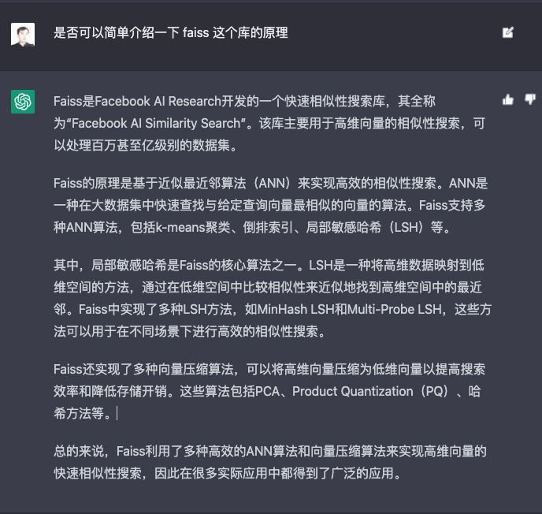

Embedding 向量适合作为一个中间结果，用于传统的机器学习场景，比如分类、聚类。而 Completion 接口，一方面可以直接拿来作为一个聊天机器人，另一方面，你只要善用提示词，就能完成合理的文案撰写、文本摘要、机器翻译等一系列的工作。

#### 让 AI 生成实验数据

```
import openai, os
import pandas as pd

openai.api_key = os.environ.get("OPENAI_API_KEY")
COMPLETION_MODEL = "text-davinci-003"

def generate_data_by_prompt(prompt):
    response = openai.Completion.create(
        engine=COMPLETION_MODEL,
        prompt=prompt,
        temperature=0.5,
        max_tokens=2048,
        top_p=1,
    )
    return response.choices[0].text

prompt = """请你生成50条淘宝网里的商品的标题，每条在30个字左右，品类是3C数码产品，标题里往往也会有一些促销类的信息，每行一条。"""
data = generate_data_by_prompt(prompt)
<!-- 将拿到的结果按行分割 -->
product_names = data.strip().split('\n')
df = pd.DataFrame({'product_name': product_names})
<!-- 去掉每一行上的一个标号 -->
df.product_name = df.product_name.apply(lambda x: x.split('.')[1].strip())
df.head()

<!-- 在生成一些女装的商品名称， 覆盖不同品类 clothes_df -->
<!-- 将两个DataFrame拼接在一起 -->
df = pd.concat([df, clothes_df], axis=0)
df = df.reset_index(drop=True)
display(df)
```

#### 通过 Embedding 进行语义搜索

使用 Elasticsearch 这个开源项目，适合中小公司提示搜索功能。其背后的搜索原理，则是先分词，然后再使用倒排索引。

简单来说，就是把上面的“气质小清新拼接百搭双肩斜挎包”这样的商品名称，拆分成“气质”“小清新”“拼接”“百搭”“双肩”“斜挎包”。每个标题都是这样切分。然后，建立一个索引，比如“气质”这个词，出现过的标题的标号，按照标号的顺序都跟在气质后边。

但是这个策略有一个缺点，就是按照同义词去简单搜索是搜索不到的。

不过，有了 OpenAI 的 Embedding 接口，我们就可以把一段文本的语义表示成一段向量。而向量之间是可以计算距离的。可以将用户的搜索通过 Embedding 接口转换为向量，然后将它和所有的商品标题计算一下余弦距离，找出离我们搜索词最近的几个向量。

实现思路：

1. 调用 OpenAI 的 API 将搜索词也转换成 Embedding。
2. 将这个 Embedding 和 DataFrame 里的每一个 Embedding 都计算一下余弦距离。
3. 根据余弦相似度去排序，返回距离最近的 n 个标题。

#### 利用 Embedding 信息进行商品推荐的冷启动

Embedding 的向量距离，不仅可以用于搜索，也可以用于商品推荐里的冷启动。

主流的推荐算法，主要是依托于用户“看了又看”这样的行为信息。但是往一个新的商品或是新的平台，没有那么多的行为数据。这个时候就可以根据商品名称在语义的相似度，来进行商品推荐。

#### 通过 FAISS 加速搜索过程

我们每次进行搜索或者推荐的时候，我们都要把输入的 Embedding 和我们要检索的数据的 Embedding 都计算一次余弦相似度。数据量大了，速度肯定慢的不行。

解决的办法可以利用一些向量数据库，或者能够快速搜索相似性的软件包。推荐 Facebook 开源的 Faiss 这个 Python 包（Facebook AI Similarity Search），也就是快速进行高维向量的相似搜索。

先把 DataFrame 里面计算好的 Embedding 向量都加载到 Faiss 索引里，然后让 Faiss 帮我们快速找到最相似的向量，来看看效果怎么样。

1. 先把整个的 Embedding 变成一个二维矩阵，整个加载到 Faiss 里边。在加载之前，先定义好 Faiss 索引的维度数，也就是 Embedding 向量的维度数。
2. 把查询编程 Embedding，然后再把 Embedding 转换成一个 numpy 的 array 向量，然后直接对刚才生成的索引 index 调用 search 方法，并且指定返回的结果数量就可以了。
3. 返回拿到的只有索引的 index，也就是加载在 Faiss 里面的第几个索引。再在 DataFrame 里面，反查到对应的 DataFrame 里面的第几行，以及这一行商品的标题是什么，就能获得搜索的结果。

Faiss 的原理，是通过 ANN 这样的近似最近邻的算法，快速实现相似性的搜索。如果你想进一步了解 Faiss 的原理，你也可以去问问 ChatGPT。



Faiss 这个库能够加载的数据量，受限于我们的内存大小。如果你的数据量进一步增长，就需要选用一些向量数据库来进行搜索。比如 OpenAI 就推荐了 [Pinecone](https://www.pinecone.io/) 和 [Weaviate](https://weaviate.io/)，周围也有不少团队使用的是 [Milvus](https://milvus.io/) 这个国人开源的产品。

当然，无论是搜索还是推荐，使用 Embedding 的相似度都只是一种快速启动的方式。需要真正做到更好的效果，一定也需要投入更复杂的策略。比如用户行为反馈，更好的排序搜索和推荐结果。但是，对于提供一个简单的搜索或者推荐功能来说，通过文本的 Embedding 的相似度，是一个很好的快速启动的方式。
