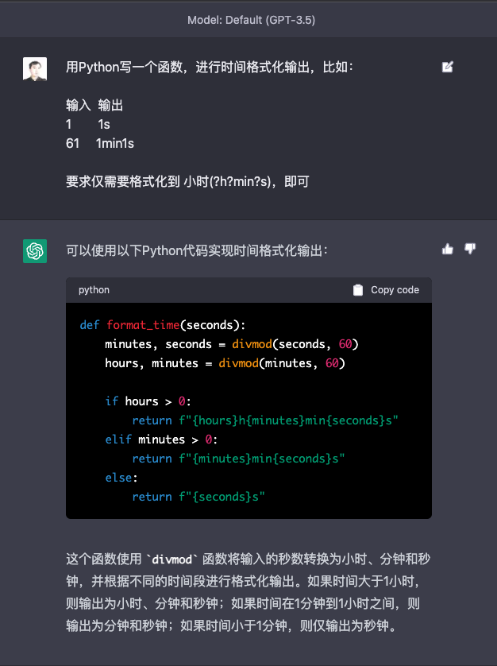
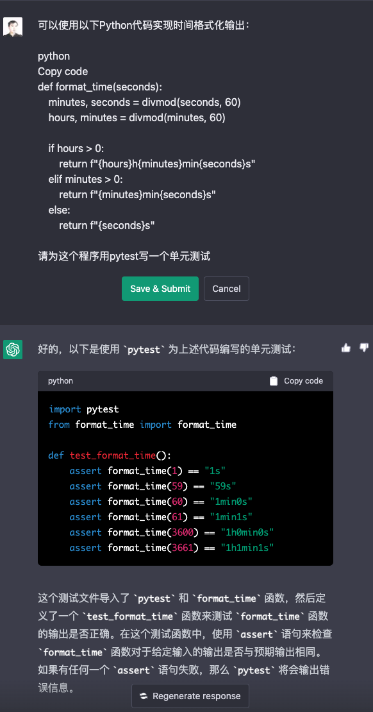
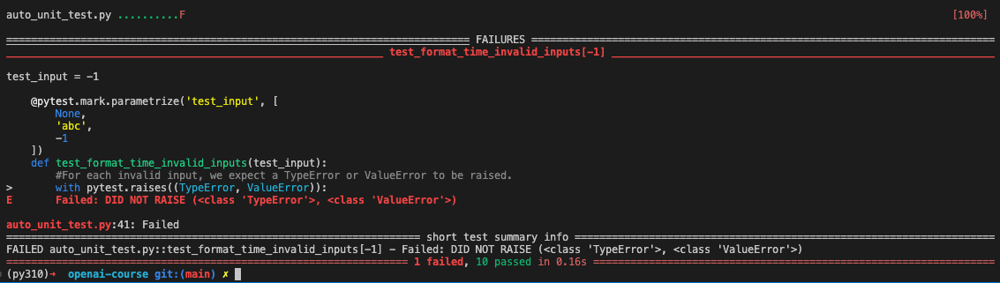

<b>先来通过大语言模型，帮我们自动写单元测试代码。</b>

这个想法，源自 OpenAI Cookbook 提供的 [AI 写单元测试的示例。](https://github.com/openai/openai-cookbook/blob/main/examples/Unit_test_writing_using_a_multi-step_prompt.ipynb)。 例子已不能使用，因为对应的 code-davinci-002 模型已经被 OpenAI 下线了。但是例子中，通过分步骤分析问题，通过多个 prompts 来完成单元测试用例的想法，还是很有借鉴意义的。

#### 设计一个需求

题目要求：让 Python 根据我们输入的一个整数代表的秒数，格式化成一段自然语言描述的时间。比如，输入 1 就返回 1s，输入 61 就返回 1min1s。

```
用Python写一个函数，进行时间格式化输出，比如：
输入  输出
1  1s
61  1min1s
要求仅需要格式化到小时(?h?min?s)，即可
```



再由代码帮我们生成单元测试

```
def format_time(seconds):
    minutes, seconds = divmod(seconds, 60)
    hours, minutes = divmod(minutes, 60)
    if hours > 0:
        return f"{hours}h{minutes}min{seconds}s"
    elif minutes > 0:
        return f"{minutes}min{seconds}s"
    else:
        return f"{seconds}s"
```


乍一看，我们的单元测试已经写完了。如果你是一个比较有经验的程序员，你就会发现这个单元测试其实还是有好几个问题的。

1. 这个测试没有考虑负数。如果我们输入的是负数会怎么样？
2. 没有考虑非整数类型的输入，如果我们输入浮点数 1.0 会怎么样？字符串“abc”会怎么样？nil 这样的空值会怎么样？
3. 是即使是整数，我们还没有考虑过，超过 24 小时的话，格式化后的结果是怎么样的。

#### 分步骤撰写 Prompts

反过来思考一下，如果是我们自己来写为一段代码写单元测试，我们会怎么做？

OpenAI 的示例给出了一个很好的思路。

1. 把代码提交给大语言模型，让大语言模型解释一下代码在做什么？
2. 把代码和代码的解释一块交给大语言模型，让大语言模型规划一下，针对这个代码逻辑，我们要写哪几个 TestCase。如果在这个过程中，大模型提供的 TestCase 太少，那就重复第二步，让 AI 多生成几条 TestCase。
3. 针对上面的 TestCase 的详细描述，再提交给大语言模型，让它根据这些描述生成具体的测试代码。如果语法检查没通过，就要让 AI 重新生成一下。

#### 请 AI 解释我们的代码

到最后，根据一步一步拆解，通过 python 程序把整个过程“自动化”掉

````
def gpt35(prompt, model="text-davinci-002", temperature=0.4, max_tokens=1000,
          top_p=1, stop=["\n\n", "\n\t\n", "\n    \n"]):
    response = openai.Completion.create(
        model=model,
        prompt = prompt,
        temperature = temperature,
        max_tokens = max_tokens,
        top_p = top_p,
        stop = stop
        )
    message = response["choices"][0]["text"]
    return message

code = """
def format_time(seconds):
    minutes, seconds = divmod(seconds, 60)
    hours, minutes = divmod(minutes, 60)

    if hours > 0:
        return f"{hours}h{minutes}min{seconds}s"
    elif minutes > 0:
        return f"{minutes}min{seconds}s"
    else:
        return f"{seconds}s"
"""

def explain_code(function_to_test, unit_test_package="pytest"):
    prompt = f""""# How to write great unit tests with {unit_test_package}

In this advanced tutorial for experts, we'll use Python 3.10 and `{unit_test_package}` to write a suite of unit tests to verify the behavior of the following function.
```python
{function_to_test}


Before writing any unit tests, let's review what each element of the function is doing exactly and what the author's intentions may have been.
- First,"""
    response = gpt35(prompt)
    return response, prompt

code_explaination, prompt_to_explain_code = explain_code(code)
print(code_explaination)
````

第一步里，做了几个事情：
首先是定义了一个 gpt35 的函数，对调用 GPT3.5 的模型做了简单的封装。有两点需要注意。

1. 我们默认使用 text-davinci-002 模型，这是一个通过监督学习微调的生成文本的模型。因为这里我们希望生成目标明确的文本的代码解释，所以选用了这个模型。
2. 对 stop 做特殊处理，如果连续两个换行或是类似连续两个换行出现，就中止数据的生成。避免模型一次性生成与测试代码。只在这一步解释我们的代码。

然后，我们通过一组精心设置过的提示语，让 GPT 模型为我们来解释代码。我们在提示语里做了 4 件事情。

1. 指定了使用 pytest 这个测试包。
2. 把对应要测试的代码，也提供给了 GPT 模型。
3. 告诉 AI，要精确描述代码做了什么。
4. 在最后一行用 “- First” 开头，引导 GPT 模型，逐步分行描述要测试的代码干了什么。

输出结果：

```
 we use the `divmod` built-in function to get the quotient and remainder of `seconds` divided by 60. This is assigned to the variables `minutes` and `seconds`, respectively.
- Next, we do the same thing with `minutes` and 60, assigning the results to `hours` and `minutes`.
- Finally, we use string interpolation to return a string formatted according to how many hours/minutes/seconds are left.
```

#### 请 AI 根据代码解释制定测试计划

```
def generate_a_test_plan(full_code_explaination, unit_test_package="pytest"):
    prompt_to_explain_a_plan = f"""

A good unit test suite should aim to:
- Test the function's behavior for a wide range of possible inputs
- Test edge cases that the author may not have foreseen
- Take advantage of the features of `{unit_test_package}` to make the tests easy to write and maintain
- Be easy to read and understand, with clean code and descriptive names
- Be deterministic, so that the tests always pass or fail in the same way

`{unit_test_package}` has many convenient features that make it easy to write and maintain unit tests. We'll use them to write unit tests for the function above.

For this particular function, we'll want our unit tests to handle the following diverse scenarios (and under each scenario, we include a few examples as sub-bullets):
-"""
    prompt = full_code_explaination + prompt_to_explain_a_plan
    response = gpt35(prompt)
    return response, prompt

test_plan, prompt_to_get_test_plan = generate_a_test_plan(prompt_to_explain_code + code_explaination)
print(test_plan)
```

我们整个测试计划的提示语，同样经过了精心设计。我们先是对 AI 做了几个要求。

1. 我们要求测试用例，尽量考虑输入的范围广一些。
2. 我们要求 AI 想一些连代码作者没有想到过的边界条件。
3. 我们希望 AI 能够利用好 pytest 这个测试包的特性。
4. 希望测试用例清晰易读，测试的代码要干净。
5. 我们要求测试代码的输出结果是确定的，要么通过，要么失败，不要有随机性。

然后，我们的提示语并没有立刻让 AI 去写测试代码，而是说我们要举几个例子。这样，AI 就会生成一系列的示例。

最后，我们发给 AI 的提示语，则是既包括了第一步要求解释代码的内容，也包括 AI 生成的对代码的解释，以及这里我们新增的对测试用例的要求，提供了非常详细的上下文，这样 AI 的表现也会更好、更有逻辑性。

输出结果：

```
 Normal behavior:
    - `format_time(0)` should return `"0s"`
    - `format_time(59)` should return `"59s"`
    - `format_time(60)` should return `"1min0s"`
    - `format_time(119)` should return `"1min59s"`
    - `format_time(3600)` should return `"1h0min0s"`
    - `format_time(3601)` should return `"1h0min1s"`
    - `format_time(3660)` should return `"1h1min0s"`
    - `format_time(7200)` should return `"2h0min0s"`
- Invalid inputs:
    - `format_time(None)` should raise a `TypeError`
    - `format_time("abc")` should raise a `TypeError`
    - `format_time(-1)` should raise a `ValueError`
```

这里运行一下，可以看到，AI 提供了很多测试用例。覆盖了好几种情况，特殊情况，负数情况，字符串，None。

生成那些方面用例其实是有一定的随机性的，这也是大模型的一个缺点，可控性差。如果生成的 3 个用例，会有很多情况我们的用例覆盖不全。所以加了一个步骤。通过“\n-”这样一个换行加横杆的标记来判断之前生成的测试用例数量，如果比我们设定的下限少，我们就再添加一段提示语，让 AI 再生成一些。

这里的提示语，我们要特别提醒 AI 考虑一下测试罕见情况和边界条件。

```
not_enough_test_plan = """The function is called with a valid number of seconds
    - `format_time(1)` should return `"1s"`
    - `format_time(59)` should return `"59s"`
    - `format_time(60)` should return `"1min"`
"""

approx_min_cases_to_cover = 7
elaboration_needed = test_plan.count("\n-") +1 < approx_min_cases_to_cover
if elaboration_needed:
        prompt_to_elaborate_on_the_plan = f"""

In addition to the scenarios above, we'll also want to make sure we don't forget to test rare or unexpected edge cases (and under each edge case, we include a few examples as sub-bullets):
-"""
        more_test_plan, prompt_to_get_test_plan = generate_a_test_plan(prompt_to_explain_code + code_explaination + not_enough_test_plan + prompt_to_elaborate_on_the_plan)
        print(more_test_plan)
```

#### 根据测试计划生成测试代码

当然，大部分情况下，生成的测试用例数都和我们前面的实际情况是一样的。那我们就可以直接用原来的代码、代码的解释以及测试用例，作为提示语，让 AI 帮我们写具体的测试了。

这里的提示语就是把已经生成的多有内容拼接在一起，然后要求根据前面的内容来写具体的代码。唯一要注意的是，为了避免 AI 忘记一开头功能代码的内容，我们特地再在提示语的最后，再次给 AI 看了一下我们要测试的功能代码。

````
def generate_test_cases(function_to_test, unit_test_package="pytest"):
    starter_comment = "Below, each test case is represented by a tuple passed to the @pytest.mark.parametrize decorator"
    prompt_to_generate_the_unit_test = f"""

Before going into the individual tests, let's first look at the complete suite of unit tests as a cohesive whole. We've added helpful comments to explain what each line does.
```python
import {unit_test_package}  # used for our unit tests

{function_to_test}

#{starter_comment}"""
    full_unit_test_prompt = prompt_to_explain_code + code_explaination + test_plan + prompt_to_generate_the_unit_test
    return gpt35(model="text-davinci-003", prompt=full_unit_test_prompt, stop="```"), prompt_to_generate_the_unit_test

unit_test_response, prompt_to_generate_the_unit_test = generate_test_cases(code)
print(unit_test_response)
````

输出结果：

```
.
#The first element of the tuple is the name of the test case, and the second element is the value to be passed to the format_time() function.
@pytest.mark.parametrize('test_input,expected', [
    ('0', '0s'),
    ('59', '59s'),
    ('60', '1min0s'),
    ('119', '1min59s'),
    ('3600', '1h0min0s'),
    ('3601', '1h0min1s'),
    ('3660', '1h1min0s'),
    ('7200', '2h0min0s'),
])
def test_format_time(test_input, expected):
    #For each test case, we call the format_time() function and compare the returned value to the expected value.
    assert format_time(int(test_input)) == expected

#We use the @pytest.mark.parametrize decorator again to test the invalid inputs.
@pytest.mark.parametrize('test_input', [
    None,
    'abc',
    -1
])
def test_format_time_invalid_inputs(test_input):
    #For each invalid input, we expect a TypeError or ValueError to be raised.
    with pytest.raises((TypeError, ValueError)):
        format_time(test_input)
```

#### 通过 AST 库进行语法检查

不过这还没有完，我们最好还是再检查一下生成的测试代码的语法，这个可以通过 Python 的 AST 库来完成。不过需要注意，检查语法的时候，我们不仅需要生成的测试代码，也需要原来的功能代码，不然是没办法通过语法检查的。

````
import ast

code_start_index = prompt_to_generate_the_unit_test.find("```python\n") + len("```python\n")
code_output = prompt_to_generate_the_unit_test[code_start_index:] + unit_test_response
try:
    ast.parse(code_output)
except SyntaxError as e:
    print(f"Syntax error in generated code: {e}")
````

一次性打印所有内容。

```
print(code_output)
```

输出结果：

```
import pytest  # used for our unit tests


def format_time(seconds):
    minutes, seconds = divmod(seconds, 60)
    hours, minutes = divmod(minutes, 60)

    if hours > 0:
        return f"{hours}h{minutes}min{seconds}s"
    elif minutes > 0:
        return f"{minutes}min{seconds}s"
    else:
        return f"{seconds}s"


#Below, each test case is represented by a tuple passed to the @pytest.mark.parametrize decorator.
#The first element of the tuple is the name of the test case, and the second element is the value to be passed to the format_time() function.
@pytest.mark.parametrize('test_input,expected', [
    ('0', '0s'),
    ('59', '59s'),
    ('60', '1min0s'),
    ('119', '1min59s'),
    ('3600', '1h0min0s'),
    ('3601', '1h0min1s'),
    ('3660', '1h1min0s'),
    ('7200', '2h0min0s'),
])
def test_format_time(test_input, expected):
    #For each test case, we call the format_time() function and compare the returned value to the expected value.
    assert format_time(int(test_input)) == expected


#We use the @pytest.mark.parametrize decorator again to test the invalid inputs.
@pytest.mark.parametrize('test_input', [
    None,
    'abc',
    -1
])
def test_format_time_invalid_inputs(test_input):
    #For each invalid input, we expect a TypeError or ValueError to be raised.
    with pytest.raises((TypeError, ValueError)):
        format_time(test_input)
```

#### 看看自动生成的测试帮我们抓了什么 Bug

我们可以把对应生成的代码，单独复制到一个 auto_unit_test.py 文件里面。然后去命令行里执行一下 pytest 这个命令，看看结果是怎样的。我这里，对应的会有一个测试用例失败，就是当输入是 -1 的时候，测试用例预期会遇到一个 TypeError 或者 ValueError 的报错，但是实际并没有。

我们可以试着在 Notebook 里面调用一下 format_time(-1)，看看自动化测试跑得对不对。

```
format_time(-1)
```

输出结果：

```
'59min59s'
```

可以看到，输入 -1 的时候，输出变成了 59min59s，看来 AI 生成的测试代码的确帮我们捕捉到了一个 Bug。
