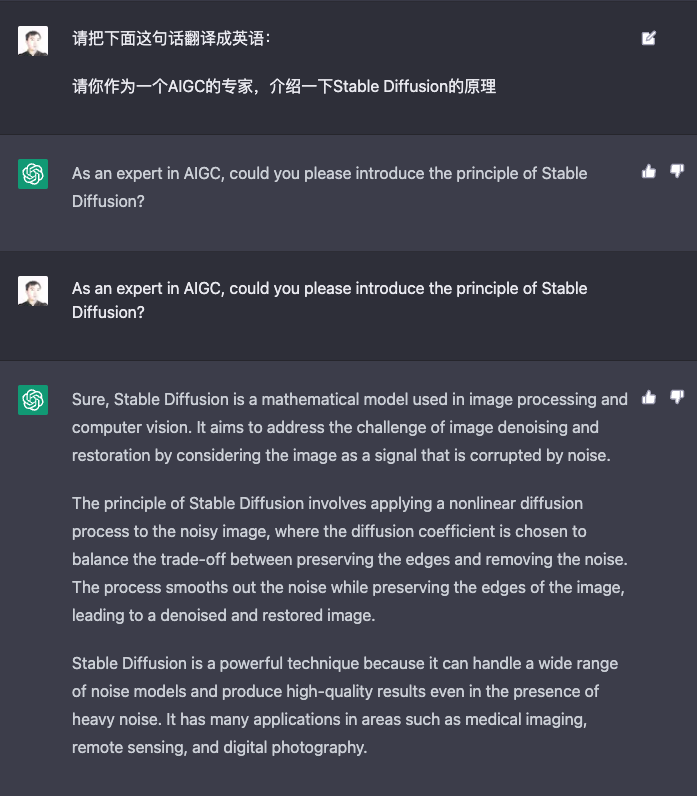
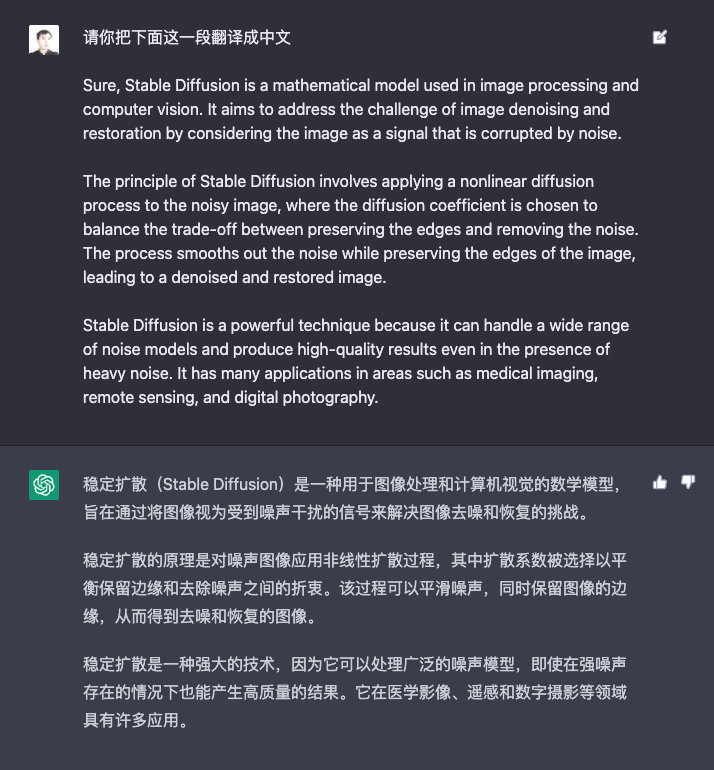
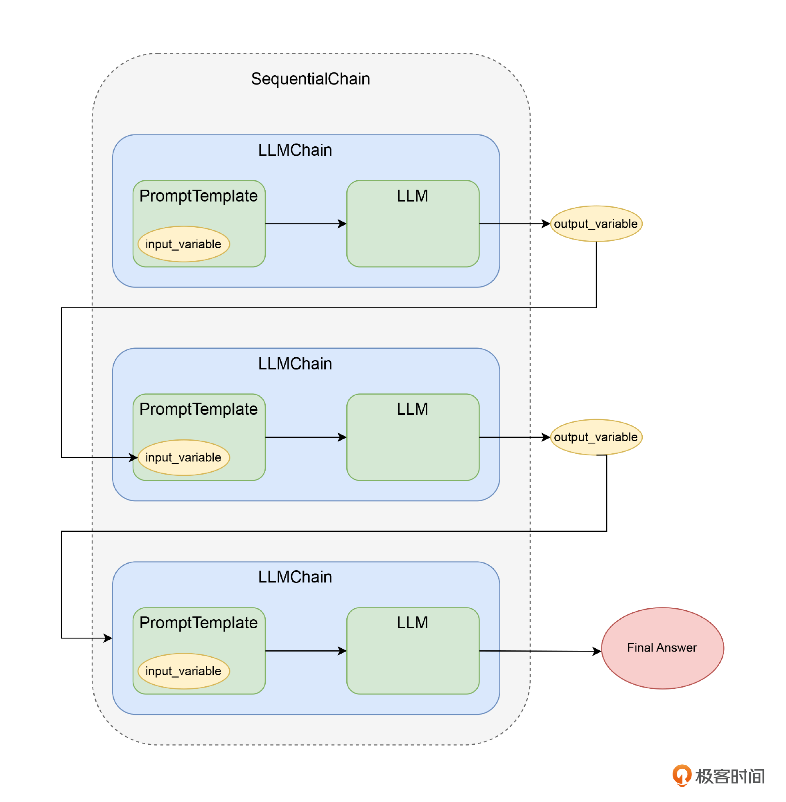

#### 使用 Langchain 的链式调用

举个 ChatGPT 例子，先用中文问问题，他回答得不好。我们让它先把中文翻译成英文。再把英文贴进去，得到一个英文答案。最后，再请 AI 把英文答案翻译成中文。

#### 人工链式调用

如果用 API 来实现这个过程，其实就是一个链式调用的过程。





1. 我们先调用 OpenAI，把翻译请求和原始问题组合在一起发送给 AI，完成问题的中译英。
2. 然后再把拿到的翻译好的英文问题发送给 OpenAI，得到英文答案。
3. 最后再把英文答案，和对应要求 AI 翻译答案的请求组合在一起，完成答案的英译中。

#### 使用 LLMChain 进行链式调用

```
import openai, os
from langchain.prompts import PromptTemplate
from langchain.llms import OpenAI
from langchain.chains import LLMChain

openai.api_key = os.environ.get("OPENAI_API_KEY")

llm = OpenAI(model_name="text-davinci-003", max_tokens=2048, temperature=0.5)

en_to_zh_prompt = PromptTemplate(
    template="请把下面这句话翻译成英文： \n\n {question}?", input_variables=["question"]
)

question_prompt = PromptTemplate(
    template = "{english_question}", input_variables=["english_question"]
)

zh_to_cn_prompt = PromptTemplate(
    input_variables=["english_answer"],
    template="请把下面这一段翻译成中文： \n\n{english_answer}?",
)

question_translate_chain = LLMChain(llm=llm, prompt=en_to_zh_prompt, output_key="english_question")
english = question_translate_chain.run(question="请你作为一个机器学习的专家，介绍一下CNN的原理。")
print(english)

qa_chain = LLMChain(llm=llm, prompt=question_prompt, output_key="english_answer")
english_answer = qa_chain.run(english_question=english)
print(english_answer)

answer_translate_chain = LLMChain(llm=llm, prompt=zh_to_cn_prompt)
answer = answer_translate_chain.run(english_answer=english_answer)
print(answer)
```

```
Please explain the principles of CNN as an expert in Machine Learning.

A Convolutional Neural Network (CNN) is a type of deep learning algorithm that is used to analyze visual imagery. It is modeled after the structure of the human visual cortex and is composed of multiple layers of neurons that process and extract features from an image. The main principle behind a CNN is that it uses convolutional layers to detect patterns in an image. Each convolutional layer is comprised of a set of filters that detect specific features in an image. These filters are then used to extract features from the image and create a feature map. The feature map is then passed through a pooling layer which reduces the size of the feature map and helps to identify the most important features in the image. Finally, the feature map is passed through a fully-connected layer which classifies the image and outputs the result.

卷积神经网络（CNN）是一种深度学习算法，用于分析视觉图像。它模仿人类视觉皮层的结构，由多层神经元组成，可以处理和提取图像中的特征。CNN的主要原理是使用卷积层来检测图像中的模式。每个卷积层由一组滤波器组成，可以检测图像中的特定特征。然后使用这些滤波器从图像中提取特征，并创建特征图。然后，将特征图通过池化层传递，该层可以减小特征图的大小，并有助于识别图像中最重要的特征。最后，将特征图传递给完全连接的层，该层将对图像进行分类，并输出结果。
```

1. LLM，也就是我们使用哪个大语言模型，来回答我们提出的问题。我们这里用 ChatGPT 3.5-turbo
2. PromptTemplate，和我们在第 11 讲里看到的 llama-index 的 PromptTemplate 是一个东西。定义一个提示语模版，里面能够定义一些可以动态替换的变量。
3. 主角 LLMChain，它的构造函数接收一个 LLM 和一个 PromptTemplate 作为参数。构造完成之后，可以直接调用里面的 run 方法，将 PromptTemplate 需要的变量，用 K=>V 对的形式传入进去。

目前对 OpenAI 的 API 做一层封装而已。我们构建了 3 个 LLMChain，然后按照顺序调用，每次拿到答案之后，再作为输入，交给下一个 LLM 调用。

加一个 SimpleSequentialChain 类，把我们要按照顺序依次调用的三个 LLMChain 放在一个数组里，传给这个类的构造函数。

然后对于这个对象，我们调用 run 方法，把我们用中文问的问题交给它。只要一开始问一遍就可以了。后边 SimpleSequentialChain 会按照顺序开始调用 chains 这个数组参数包含的其他 LLMChain，并且每次调用的结果，都会存储在这个 Chain 构造时定义的 output_key 参数里。而调用下一个 LLMChain，里边模型内变量如果有和 output_key 名字相同，就会用 output_key 存的内容替换掉占位符。

```
from langchain.chains import SimpleSequentialChain

chinese_qa_chain = SimpleSequentialChain(
    chains=[question_translate_chain, qa_chain, answer_translate_chain], input_key="question",
    verbose=True)
answer = chinese_qa_chain.run(question="请你作为一个机器学习的专家，介绍一下CNN的原理。")
print(answer)
```

```
> Entering new SimpleSequentialChain chain...

Please introduce the principle of CNN as a machine learning expert.

Convolutional Neural Networks (CNNs) are a type of artificial neural network that are commonly used in image recognition and classification tasks. They are inspired by the structure of the human brain and are composed of multiple layers of neurons connected in a specific pattern. The neurons in the first layer of a CNN are connected to the input image, and the neurons in the last layer are connected to the output. The neurons in between the input and output layers are called feature maps and are responsible for extracting features from the input image. CNNs use convolutional layers to detect patterns in the input image and pooling layers to reduce the size of the feature maps. This allows the CNN to learn the most important features in the image and use them to make predictions.

卷积神经网络（CNN）是一种常用于图像识别和分类任务的人工神经网络。它们受到人脑结构的启发，由多层神经元以特定模式连接而成。CNN的第一层神经元与输入图像连接，最后一层神经元与输出连接。输入和输出层之间的神经元称为特征映射，负责从输入图像中提取特征。CNN使用卷积层检测输入图像中的模式，使用池化层减小特征映射的大小。这使得CNN能够学习图像中最重要的特征，并利用它们进行预测。
> Finished chain.
```

```
卷积神经网络（CNN）是一种常用于图像识别和分类任务的人工神经网络。它们受到人脑结构的启发，由多层神经元以特定模式连接而成。CNN的第一层神经元与输入图像连接，最后一层神经元与输出连接。输入和输出层之间的神经元称为特征映射，负责从输入图像中提取特征。CNN使用卷积层检测输入图像中的模式，使用池化层减小特征映射的大小。这使得CNN能够学习图像中最重要的特征，并利用它们进行预测。
```

有一点需要注意，LLMChain 在 PromptTemplate 输入的参数，之前必须在 LLMChain 里，通过 output_key 定义过。不然，这个变量没有值，程序就会报错。

#### 支持多个变量输入的链式调用

事实上，因为使用变量的输入输出，是用这些参数定义的。所以我们不是只能用前一个 LLMChain 的输出作为后一个 LLMChain 的输入。我们完全可以连续问多个问题，然后把这些问题的答案，作为后续问题的输入来继续处理。

#### 通过 Langchain 实现自动化撰写单元测试

上一节刚刚讲过多步 Prompt 自动给代码写单元测试。具体实现功能与上一节一摸一样。只是使用了 LLMChain 做了封装。

对于重试，我们则是通过一个 while 循环来调用 write_unit_test。拿到的结果和输入的代码拼装在一起，交给 AST 库做解析。如果解析通不过，则重试整个单元测试生成的过程，直到达到我们最大的重试次数为止。


_LLMChain 就是一个对大语言模型进行链式调用的模式，前面的变量和输出都可以作为下一轮调用的变量输入_
