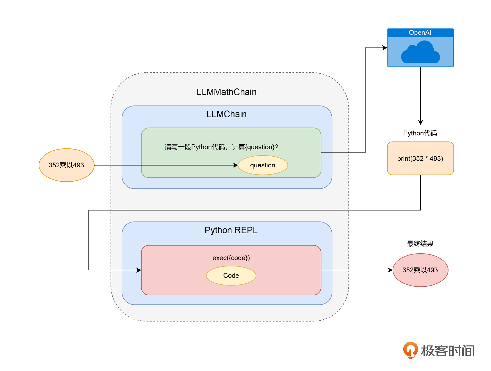
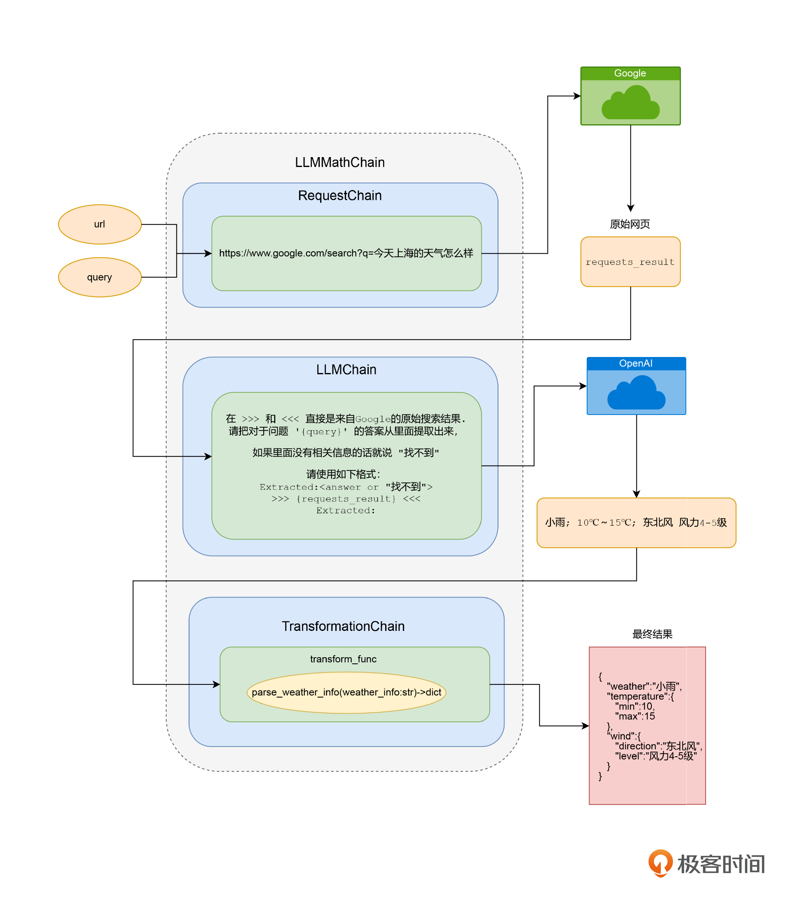

#### 解决 AI 数理能力的难题

虽然 ChatGPT 回答各种问题的时候都像模像样的，但是一到计算三位数乘法的时候就露馅儿了。感觉它只是预估了一个数字，而不是真准确的计算。

虽然 ChatGPT 计算不行，但是可以用它写一段 python 的计算公式。然后再调用 python 的解释器。

LangChain 里面内置了一个 utilities 的包，里面包含了 PythonREPL 这个类，可以实现对 Python 解释器的调用。

utilities 里面还有很多其他的类，能够实现很多功能，比如可以直接运行 Bash 脚本，调用 Google Search 的 API 等等。

其实实现还是链式调用，只是调用链式的第二步，不是访问 OpenAI 的 API，而是生成 Python 脚本，再调用 python 的解释器的过程。LangChain 就把这个过程封装成了一个叫做 LLMMathChain 的 LLMChain。

SQLDatabaseChain、LLMRequestsChain



#### 通过 RequestsChain 获取实时外部信息

时效性比较强的问题，比如获取实时的天气情况。可以使用 LLMRequestsChain，通过一个请求来获取问题的答案。

使用到了好几个技巧：

1. 首先简单粗暴的搜索 Google，但我们需要的是天气信息而不是整个网页。所以需要 ChatGPT 找出答案。我们定义一个 PromptTemplate，通过一段提示语让 OpenAI 在搜索结果中找出答案，而不是原始 HTML 页面。
2. 然后使用 LLMRequestsChain，将 PromptTemplate 构造一个普通的 LLMChain，作为构造函数的一个参数，传给 LLMRequestsChain。
3. 对应的搜索词，通过 query 这个参数传入，对应的原始搜索结果，则会默认放到 requests_results 里。而通过我们自己定义的 PromptTemplate 抽取出来的最终答案，则会放到 output 这个输出参数里面。

#### 通过 TransformationChain 转换数据格式

1. 先定义了一个 transform_func，对前面的 parse_weather_info 函数做了一下简单的封装。它的输入，是整个 LLMChain 里，执行到 TransformChain 之前的整个输出结果的 dict。
2. 然后，我们就定义了一个 TransformChain，里面的输入参数就是 output，输出参数就是 weather_info。
3. 最后，我们通过上一讲用过的 SequentialChain，将前面的 LLMRequestsChain 和这里的 TransformChain 串联到一起，变成一个新的叫做 final_chain 的 LLMChain。



#### 通过 VectorDBQA 来实现先搜索再回复的能力

```
from langchain.embeddings.openai import OpenAIEmbeddings
from langchain.vectorstores import FAISS
from langchain.text_splitter import SpacyTextSplitter
from langchain import OpenAI, VectorDBQA
from langchain.document_loaders import TextLoader

llm = OpenAI(temperature=0)
loader = TextLoader('./data/ecommerce_faq.txt')
documents = loader.load()
text_splitter = SpacyTextSplitter(chunk_size=256, pipeline="zh_core_web_sm")
texts = text_splitter.split_documents(documents)

embeddings = OpenAIEmbeddings()
docsearch = FAISS.from_documents(texts, embeddings)

faq_chain = VectorDBQA.from_chain_type(llm=llm, vectorstore=docsearch, verbose=True)
```

_注：上面的代码创建了一个基于 FAISS 进行向量存储的 docsearch 的索引，以及基于这个索引的 VectorDBQA 这个 LLMChain。_

通过一段代码，我们通过一个 TextLoader 把文件加载进来，还通过 SpacyTextSplitter 给文本分段，确保每个分出来的 Document 都是一个完整的句子。因为我们这里的文档是电商 FAQ 的内容，都比较短小精悍，所以我们设置的 chunk_size 只有 256。然后，我们定义了使用 OpenAIEmbeddings 来给文档创建 Embedding，通过 FAISS 把它存储成一个 VectorStore。最后，我们通过 VectorDBQA 的 from_chain_type 定义了一个 LLM。对应的 FAQ 内容，我是请 ChatGPT 为我编造之后放在了 ecommerce_faq.txt 这个文件里。

问题：

```
question = "请问你们的货，能送到三亚吗？大概需要几天？"
result = faq_chain.run(question)
print(result)
```

输出结果：

```
> Entering new VectorDBQA chain...
> Finished chain.
 我们支持全国大部分省份的配送，包括三亚。一般情况下，大部分城市的订单在2-3个工作日内送达，偏远地区可能需要5-7个工作日。具体送货时间可能因订单商品、配送地址和物流公司而异。
```

问题：

```
question = "请问你们的退货政策是怎么样的？"
result = faq_chain.run(question)
print(result)
```

输出结果：

```
> Entering new VectorDBQA chain...
> Finished chain.
自收到商品之日起7天内，如产品未使用、包装完好，您可以申请退货。某些特殊商品可能不支持退货，请在购买前查看商品详情页面的退货政策。
```

在 VectorDBQA 这个 LLMChain 背后，其实也是通过一系列的链式调用，来完成搜索 VectorStore，再向 AI 发起 Completion 请求这样两个步骤的。
