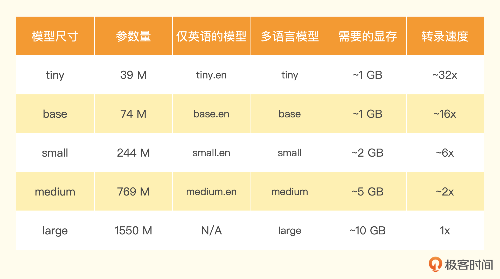

语音识别模型--Whisper

#### Whisper API 101

通过 Whisper 和 ChatGPT， 组合这两个 API。我想通过 Whisper 把想要听的播客转录成文字稿，再通过 ChatGPT 做个小结，看看 AI 总结的小结内容是不是我想要听的。

通过 [listennotes](https://www.listennotes.com/) 这个网站来搜索播客，还能够下载博客的源文件，同时还支持直接切出播客中的一段内容，创建一个切片。

OpenAI 提供的 Whisper 的 API 非常简单，你只要调用一下 transcribe 函数，就能将音频文件转录成文字。

```
import openai, os

openai.api_key = os.getenv("OPENAI_API_KEY")

audio_file= open("./data/podcast_clip.mp3", "rb")
transcript = openai.Audio.transcribe("whisper-1", audio_file)
print(transcript['text'])
```

输出结果：

```
欢迎来到 Onboard 真实的一线经验 走新的投资思考 我是 Monica 我是高宁 我们一起聊聊软件如何改变世界 大家好 欢迎来到 Onboard 我是 Monica 自从OpenAI发布的ChatGBT 掀起了席卷世界的AI热潮 不到三个月就积累了 超过一亿的越货用户 超过1300万的日货用户 真的是展现了AI让人惊讶的 也让很多人直呼 这就是下一个互联网的未来 有不少观众都说 希望我们再做一期AI的讨论 于是这次硬核讨论就来了 这次我们请来了 Google Brain的研究员雪芝 她是Google大语言模型PALM Pathway Language Model的作者之一 要知道这个模型的参数量 是GPT-3的三倍还多 另外还有两位AI产品大牛 一位来自著名的StableDM 背后的商业公司Stability AI 另一位来自某硅谷科技大厂 也曾在吴恩达教授的Landing AI中 担任产品负责人 此外 莫妮凯还邀请到一位 一直关注AI的投资人朋友Bill 当做我的特邀共同主持嘉宾 我们主要讨论几个话题 一方面从研究的视角 最前沿的研究者在关注什么 现在技术的天花板 和未来大的变量可能会在哪里 第二个问题是 未来大的变量可能会在哪里 从产品和商业的角度 什么是一个好的AI产品 整个生态可能随着技术 有怎样的演变 更重要的 我们又能从上一波 AI的创业热潮中学到什么 最后 莫妮凯和Bill还会从投资人的视角 做一个回顾 总结和畅想 这里还有一个小的update 在本集发布的时候 Google也对爆发式增长的 Chad GPT做出了回应 正在测试一个基于Lambda 模型的聊天机器人 ApprenticeBot 正式发布后会有怎样的惊喜 我们都拭目以待 AI无疑是未来几年 最令人兴奋的变量之一 莫妮凯也希望未来能邀请到更多 一线从业者 从不同角度讨论这个话题 不论是想要做创业 研究 产品 还是投资的同学 希望这些对话 对于大家了解这些技术演进 商业的可能 甚至未来对于我们每个人 每个社会意味着什么 都能引发一些思考 提供一些启发 这次的讨论有些技术硬核 需要各位对生成式AI 大模型都有一些基础了解 讨论中涉及到的论文和重要概念 也会总结在本集的简介中 供大家复习参考 几位嘉宾在北美工作生活多年 夹杂英文在所难免 也请大家体谅了 欢迎来到未来 希望大家enjoy
```

转录的结果有一个问题，转录出来的内容只有空格的分隔符，没有标点符号。

解决办法只要在前面的代码里面，增加一个 Prompt 参数就好了。

```
audio_file= open("./data/podcast_clip.mp3", "rb")
transcript = openai.Audio.transcribe("whisper-1", audio_file,
                                     prompt="这是一段中文播客内容。")
print(transcript['text'])
```

```
欢迎来到 Onboard,真实的一线经验,走新的投资思考。 我是 Monica。 我是高宁。我们一起聊聊软件如何改变世界。 大家好,欢迎来到 Onboard,我是 Monica。 自从 OpenAI 发布的 ChatGBT 掀起了席卷世界的 AI 热潮, 不到三个月就积累了超过一亿的越活用户,超过一千三百万的日活用户。 真的是展现了 AI 让人惊叹的能力, 也让很多人直呼这就是下一个互联网的未来。 有不少观众都说希望我们再做一期 AI 的讨论, 于是这次硬核讨论就来了。 这次我们请来了 Google Brain 的研究员雪芝, 她是 Google 大语言模型 PAMP,Pathway Language Model 的作者之一。 要知道,这个模型的参数量是 GPT-3 的三倍还多。 另外还有两位 AI 产品大牛,一位来自著名的 Stable Diffusion 背后的商业公司 Stability AI, 另一位来自某硅谷科技大厂,也曾在吴恩达教授的 Landing AI 中担任产品负责人。 此外,Monica 还邀请到一位一直关注 AI 的投资人朋友 Bill 当作我的特邀共同主持嘉宾。 我们主要讨论几个话题,一方面从研究的视角,最前沿的研究者在关注什么? 现在技术的天花板和未来大的变量可能会在哪里? 从产品和商业的角度,什么是一个好的 AI 产品? 整个生态可能随着技术有怎样的演变? 更重要的,我们又能从上一波 AI 的创业热潮中学到什么? 最后,Monica 和 Bill 还会从投资人的视角做一个回顾、总结和畅想。 这里还有一个小的 update,在本集发布的时候, Google 也对爆发式增长的ChatGPT 做出了回应, 正在测试一个基于 Lambda 模型的聊天机器人 ApprenticeBot。 正式发布后会有怎样的惊喜?我们都拭目以待。 AI 无疑是未来几年最令人兴奋的变量之一, Monica 也希望未来能邀请到更多一线从业者从不同角度讨论这个话题。 不论是想要做创业、研究、产品还是投资的同学, 希望这些对话对于大家了解这些技术演进、商业的可能, 甚至未来对于我们每个人、每个社会意味着什么, 都能引发一些思考,提供一些启发。 这次的讨论有些技术硬核,需要各位对生成式 AI 大模型都有一些基础了解。 讨论中涉及到的论文和重要概念,也会总结在本集的简介中,供大家复习参考。 几位嘉宾在北美工作生活多年,夹杂英文在所难免,也请大家体谅了。 欢迎来到未来,大家 enjoy!
```

不过这样转录之后还有一点小瑕疵，就是中英文混排的内容里面，英文后边会多一些空格。那我们就再修改一下 Prompt，在提示语里面也使用中英文混排并且不留空格。

```
audio_file= open("./data/podcast_clip.mp3", "rb")
transcript = openai.Audio.transcribe("whisper-1", audio_file,
                                     prompt="这是一段Onboard播客的内容。")
print(transcript['text'])
```

<b>能够在音频内容的转录之前提供一段 Prompt，来引导模型更好地做语音识别，是 Whisper 模型的一大亮点。</b>

如果你觉得音频里会出现很多专用名词，模型容易识别错，你就可以在 Prompt 里加上对应的专用名词。

```
audio_file= open("./data/podcast_clip.mp3", "rb")
transcript = openai.Audio.transcribe("whisper-1", audio_file,
                                     prompt="这是一段Onboard播客，里面会聊到ChatGPT以及PALM这个大语言模型。这个模型也叫做Pathways Language Model。")
print(transcript['text'])
```

除了模型名称、音频文件和 Prompt 之外，transcribe 接口还支持这样三个参数。

1. response_format，也就是返回的文件格式，我们这里是默认值，也就是 JSON。实际你还可以选择 TEXT 这样的纯文本，或者 SRT 和 VTT 这样的音频字幕格式。
2. temperature，这个和我们之前在 ChatGPT 类型模型里的参数含义类似，就是采样下一帧的时候，如何调整概率分布。这里的参数范围是 0-1 之间。
3. language，就是音频的语言。提前给模型指定音频的语言，有助于提升模型识别的准确率和速度。

试着修改看一下：

```
audio_file= open("./data/podcast_clip.mp3", "rb")
transcript = openai.Audio.transcribe("whisper-1", audio_file, response_format="srt",
                                     prompt="这是一段Onboard播客，里面会聊到PALM这个大语言模型。这个模型也叫做Pathways Language Model。")
print(transcript)
```

```
1
00:00:01,000 --> 00:00:07,000
欢迎来到Onboard,真实的一线经验,走新的投资思考。我是Monica。
2
00:00:07,000 --> 00:00:11,000
我是高宁。我们一起聊聊软件如何改变世界。
3
00:00:15,000 --> 00:00:17,000
大家好,欢迎来到Onboard,我是Monica。
4
00:00:17,000 --> 00:00:28,000
自从OpenAI发布的ChatGBT掀起了席卷世界的AI热潮,不到三个月就积累了超过一亿的越活用户,超过1300万的日活用户。
5
00:00:28,000 --> 00:00:34,000
真的是展现了AI让人惊叹的能力,也让很多人直呼这就是下一个互联网的未来。
6
00:00:34,000 --> 00:00:41,000
有不少观众都说希望我们再做一期AI的讨论,于是这次硬核讨论就来了。
7
...
欢迎来到未来,大家enjoy!
```

#### 转录的时候顺便翻译一下

除了基本的音频转录功能，Whisper 的 API 还额外提供了一个叫做 translation 的接口。这个接口可以在转录音频的时候直接把语音翻译成英文，我们不妨来试一下。

```
audio_file= open("./data/podcast_clip.mp3", "rb")
translated_prompt="""This is a podcast discussing ChatGPT and PaLM model.
The full name of PaLM is Pathways Language Model."""
transcript = openai.Audio.translate("whisper-1", audio_file,
                                    prompt=translated_prompt)
print(transcript['text'])
```

目前只支持翻译成英文。

#### 通过分割音频来处理大文件

刚才我们只是尝试转录了一个 3 分钟的音频片段，那接下来我们就来转录一下整个音频。不过，我们没法把整个 150 分钟的播客一次性转录出来，因为 OpenAI 限制 Whisper 一次只能转录 25MB 大小的文件。所以我们要先把大的播客文件分割成一个个小的片段，转录完之后再把它们拼起来。我们可以选用 OpenAI 在官方文档里面提供的 PyDub 的库来分割文件。

首先将下载的 MP4 格式转换成 MP3 格式。

通过 PyDub 的 AudioSegment 包，我们可以把整个长的 MP3 文件加载到内存里面来变成一个数组。里面每 1 毫秒的音频数据就是数组里的一个元素，我们可以很容易地将数组按照时间切分成每 15 分钟一个片段的新的 MP3 文件。

```
from pydub import AudioSegment

podcast = AudioSegment.from_mp3("./data/podcast_long.mp3")

# PyDub handles time in milliseconds
ten_minutes = 15 * 60 * 1000

total_length = len(podcast)

start = 0
index = 0
while start < total_length:
    end = start + ten_minutes
    if end < total_length:
        chunk = podcast[start:end]
    else:
        chunk = podcast[start:]
    with open(f"./data/podcast_clip_{index}.mp3", "wb") as f:
        chunk.export(f, format="mp3")
    start = end
    index += 1
```

在切分完成之后，我们就一个个地来转录对应的音频文件，对应的代码就在下面。

```
prompt = "这是一段Onboard播客，里面会聊到ChatGPT以及PALM这个大语言模型。这个模型也叫做Pathways Language Model。"
for i in range(index):
    clip = f"./data/podcast_clip_{i}.mp3"
    audio_file= open(clip, "rb")
    transcript = openai.Audio.transcribe("whisper-1", audio_file,
                                     prompt=prompt)
    # mkdir ./data/transcripts if not exists
    if not os.path.exists("./data/transcripts"):
        os.makedirs("./data/transcripts")
    # write to file
    with open(f"./data/transcripts/podcast_clip_{i}.txt", "w") as f:
        f.write(transcript['text'])
    # get last sentence of the transcript
    sentences = transcript['text'].split("。")
    prompt = sentences[-1]
```

#### 通过开源模型直接在本地转录

先安装 openai-whisper 的相关的依赖包。

```
%pip install openai-whisper
%pip install setuptools-rust
```

代码本身很简单，我们只是把原先调用 OpenAI 的 API 的地方，换成了加载 Whisper 的模型，然后在 transcribe 的参数上，有一些小小的差异。其他部分的代码和前面我们调用 OpenAI 的 Whisper API 的代码基本上是一致的。

```
import whisper

model = whisper.load_model("large")
index = 11 # number of fi

def transcript(clip, prompt, output):
    result = model.transcribe(clip, initial_prompt=prompt)
    with open(output, "w") as f:
        f.write(result['text'])
    print("Transcripted: ", clip)

original_prompt = "这是一段Onboard播客，里面会聊到ChatGPT以及PALM这个大语言模型。这个模型也叫做Pathways Language Model。\n\n"
prompt = original_prompt
for i in range(index):
    clip = f"./drive/MyDrive/colab_data/podcast/podcast_clip_{i}.mp3"
    output = f"./drive/MyDrive/colab_data/podcast/transcripts/local_podcast_clip_{i}.txt"
    transcript(clip, prompt, output)
    # get last sentence of the transcript
    with open(output, "r") as f:
        transcript = f.read()
    sentences = transcript.split("。")
    prompt = original_prompt + sentences[-1]
```

有一个点你可以注意一下，Whisper 的模型和我们之前看过的其他开源模型一样，有好几种不同尺寸。你可以通过 load_model 里面的参数来决定加载什么模型。



#### 结合 ChatGPT 做内容小结

无论是使用 API 还是通过本地的 GPU 进行文本转录，我们都会获得转录之后的文本。要给这些文本做个小结，可以参考在[第 10 讲](./19.md)讲解 llama-index 的示例。

```
from langchain.chat_models import ChatOpenAI
from langchain.text_splitter import SpacyTextSplitter
from llama_index import GPTListIndex, LLMPredictor, ServiceContext, SimpleDirectoryReader
from llama_index.node_parser import SimpleNodeParser

# define LLM
llm_predictor = LLMPredictor(llm=ChatOpenAI(temperature=0, model_name="gpt-3.5-turbo", max_tokens=1024))

text_splitter = SpacyTextSplitter(pipeline="zh_core_web_sm", chunk_size = 2048)
parser = SimpleNodeParser(text_splitter=text_splitter)
documents = SimpleDirectoryReader('./data/transcripts').load_data()
nodes = parser.get_nodes_from_documents(documents)

service_context = ServiceContext.from_defaults(llm_predictor=llm_predictor)

list_index = GPTListIndex(nodes=nodes, service_context=service_context)
response = list_index.query("请你用中文总结一下我们的播客内容:", response_mode="tree_summarize")
print(response)
```

输出结果：

```
这个播客讨论了人工智能和深度学习领域的高级技术和最新发展，包括稳定性人工智能、语言模型的预训练方法、图像生成模型的训练和优化，以及各种机器学习模型的比较和应用场景。同时，我们探讨了开源社区的作用和趋势，以及开源商业化的优缺点及如何应对。我们还讨论了人工智能在各个领域的应用和未来发展趋势，并强调了找到实际应用场景和解决实际问题的重要性。最后，我们提醒说，未来值得期待的AI应用将是能够真正跟人交互的产品，对于创业公司来说，需要从用户实际的痛点出发去考虑如何更好地应用AI技术。
```
