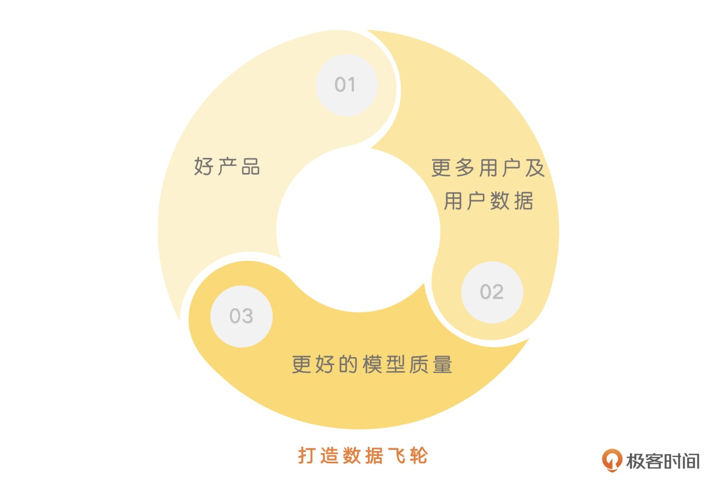

### 从 Midjourney 开始，探索 AI 产品的用户体验

<b>Midjourney 值得借鉴的地方，以用户社区作为入门教程、给用户即时反馈以及搭建数据飞轮以迭代模型。</b>

#### 善用用户社区，降低上手门槛

Midjourney 在用户注册成功之后，进入 Midjourney 的 Discord 频道之后，直接进入某一个新的聊天室。你可以在聊天室不停的刷到自己的或是其他人的画画案例。你只需要简单地复制粘贴提示语，然后修改几个单词，就可以尝试复刻其他人相同风格的画作了。

通过“共享”用户创建的内容这样的方式，Midjourney 很容易地让整个社区成为了教会新用户使用产品的通道。而不需要自己费劲费力地去写教程，或者提供大量的新手引导功能。

ChatGPT 缺少这样的功能，外部的开发者提供了 ShareGPT、FlowGPT 这样的工具，就可以这样分享 ChatGPT 对话内容以及特定、有趣的提示语网站了。

#### AI 应用面临的技术限制

Midjourney 在产品设计里的第一个挑战，就是响应时间问题。像 Midjourney 一样，面对消费者提供服务，你还会面临一个问题，就是所有的用户请求需要排队。并且，最好能够按照一个批次（Batch）进行处理。

这是由我们通过 GPU 来生成内容的原理决定的，GPU 不像 CPU 那样可以通过多线程或者时分复用的方式来处理请求，而只适合顺序地处理请求。而为了让显卡的利用率最大化，最好的办法是一个批次能够同时处理多张图片。

#### 通过及时反馈，提升用户体验

预测是，你发给 Midjourney 的请求在它服务器端的集群里一样会先去排队。等你和其他人的请求凑满一个批次，才会去生成图片。

Midjourney 解决问题的办法，则是尽可能让用户能在等待过程中看到这个任务是有进展的。

此外，针对每次你输入的提示语，Midjourney 并不是为你直接生成一张高清晰度的大图，而是生成了 4 张不同的图片。一次性生成控制性太差。

#### 搭建数据飞轮，快速迭代模型

Midjourney 出图质量很好，背后有一个很重要的元素，它拥有更多高质量的标注数据。

1. Favorite
2. “刷新”按钮 、Make Variation
3. 点击四格图下方的 V1-V4 按钮中的一个，以四格图里面的一张为基础，再生成 4 张相似的图片。

通过用户每次的正向反馈，不经意间为 Midjourney 标注了海量的数据。

<b>对于 AIGC 应用，这样“隐式”反馈信息的使用也是非常重要的。</b>
<b>好的产品->更多的用户数据->更好的模型质量->更好的产品就进入了一个正向循环。</b>

